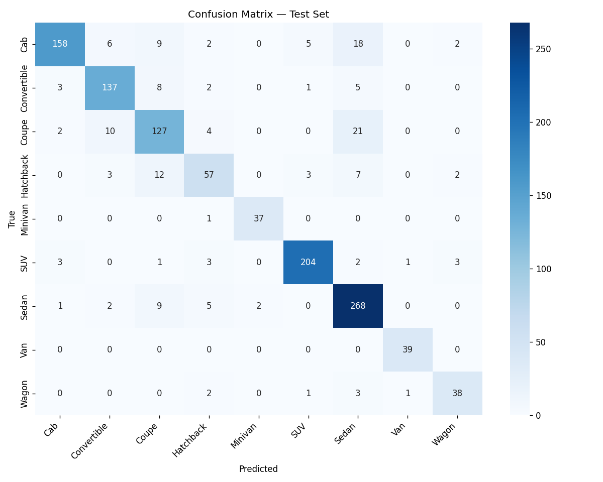

# car body type classification

A ResNet50 image classifier that predicts a car's body type from a photo. Trained on 8,144 images across 9 body type classes, fine-tuned from ImageNet weights on a Google Colab T4 GPU.

**🔗 [Live Demo on Hugging Face Spaces](https://huggingface.co/spaces/Mosalah89/stanford-car-body-classifier)**

---

## Results

| Metric | Value |
| :--- | :--- |
| **Test Accuracy** | 86.6% |
| **F1-macro** | 86.9% |
| **Best Validation Accuracy** | 88.5% |
| **Classes** | 9 |
| **Model** | ResNet50 (ImageNet pretrained) |
| **Training Time** | ~45 minutes (18 epochs, T4 GPU) |

### Confusion Matrix



### Per-Class Performance

| Body Type | Precision | Recall | F1 Score | Support |
| :--- | :--- | :--- | :--- | :--- |
| Van | 0.951 | 1.000 | **0.975** | 39 |
| Minivan | 0.949 | 0.974 | **0.961** | 38 |
| SUV | 0.953 | 0.940 | **0.947** | 217 |
| Sedan | 0.827 | 0.934 | 0.877 | 287 |
| Convertible | 0.867 | 0.878 | 0.873 | 156 |
| Cab | 0.946 | 0.790 | 0.861 | 200 |
| Wagon | 0.844 | 0.844 | 0.844 | 45 |
| Coupe | 0.765 | 0.774 | 0.770 | 164 |
| Hatchback | 0.750 | 0.679 | 0.713 | 84 |
| **Macro avg** | **0.873** | **0.868** | **0.869** | 1230 |
| **Weighted avg** | **0.869** | **0.866** | **0.865** | 1230 |

### Interpretation

The model performs **strongest on visually distinct body types** — Van, Minivan, and SUV are large, tall vehicles with unique silhouettes. It performs **weakest on visually similar compact cars** — Hatchback, Coupe, and Sedan overlap heavily in shape, and even human annotators often disagree on the boundary between them.

Two patterns worth noting:

- **Cab has high precision (0.946) but low recall (0.790)** — when the model says "Cab," it's almost always right, but it misses about 21% of actual Cabs (confusing them with Pickup or Van).
- **Sedan has the highest support (287) and strong recall (0.934)** — the model is confident and correct on the most common class.

This is expected behavior for fine-grained vehicle classification. Improving the bottom three classes would require either more training data for those categories or a specialized architecture (e.g., part-based attention).

---

## Dataset

| Property | Value |
| :--- | :--- |
| **Source** | [Stanford Car Body Type (Kaggle)](https://www.kaggle.com/datasets/mayurmahurkar/stanford-car-body-type-data) |
| **Original** | [Stanford Cars Dataset](https://ai.stanford.edu/~jkrause/cars/car_dataset.html) |
| **Images** | 8,144 |
| **Classes** | 9 body types |
| **Size on Disk** | ~1.2 GB |
| **Format** | Folder-per-class (`train/SUV/`, `train/Sedan/`, ...) |

### Classes

`Cab`, `Convertible`, `Coupe`, `Hatchback`, `Minivan`, `SUV`, `Sedan`, `Van`, `Wagon`

### Splits

| Split | Images | Percentage |
| :--- | :--- | :--- |
| Train | 5,696 | 70% |
| Validation | 1,218 | 15% |
| Test | 1,230 | 15% |

The split is **stratified** — class ratios are preserved across all three sets to prevent the rarer classes (Minivan, Van) from being underrepresented in validation or test.

### Preprocessing Notes

- The original dataset contained an **"Other" folder** with SuperCab images. These were **merged into "Cab"** to produce a clean 9-class problem, following the dataset author's suggestion in `data_info.txt`.
- All images resized to 256px, center-cropped to 224×224.
- Normalized with ImageNet statistics (`mean=[0.485, 0.456, 0.406]`, `std=[0.229, 0.224, 0.225]`).

---

## Approach

### Model

**ResNet50** pretrained on ImageNet, with the final fully-connected layer replaced:

```python
model = models.resNet50(weights=models.ResNet50_Weights.DEFAULT)
model.fc = nn.Linear(model.fc.in_features, 9)
```
Transfer learning was chosen because 8,144 images is far too small to train a deep CNN from scratch. ImageNet features (edges, textures, shapes) transfer well to vehicle classification.

```text
Training Configuration
Hyperparameter	Value
Optimizer	SGD
Learning Rate	1e-3
Momentum	0.9
Weight Decay	1e-4
Scheduler	CosineAnnealingLR
Batch Size	32
Epochs	18
Loss	CrossEntropyLoss
Image Size	224 × 224
```

### Data Augmentation
#### Applied only during training (not validation/test):

- RandomResizedCrop(224) — random scale and aspect ratio

- RandomHorizontalFlip() — 50% probability

- ColorJitter(brightness=0.2, contrast=0.2, saturation=0.2) — photometric variation

Why 18 Epochs?
Training was stopped at epoch 18 rather than the planned 25 for two reasons:

1. Diminishing returns — val accuracy plateaued around 88–89% from epoch 14 onward.

2. Data I/O bottleneck — reading 5,700 images per epoch from Google Drive took ~170s of pure loading time per epoch. The GPU sat idle most of the time. The decision was made to ship the model rather than wait for the marginal 1–2% gain.

The best checkpoint (highest val accuracy across all 18 epochs) is what's deployed.

### Project Structure

```text
car-body-type-classification/
├── notebook/
│   └── car_body_type.ipynb      # Full training pipeline (Colab)
├── eval/
│   └── confusion_matrix.png     # Test set confusion matrix
├── app.py                       # Gradio demo application
├── model_info.json              # Class names + preprocessing config
├── requirements.txt
├── README.md
└── LICENSE
```

What each file does
File	Purpose
notebook/car_body_type.ipynb	End-to-end training: data download, split, training loop, evaluation
eval/confusion_matrix.png	Visual breakdown of per-class predictions
app.py	Gradio interface for inference (also runs on Hugging Face Spaces)
model_info.json	Metadata: class labels, image size, normalization stats
requirements.txt	Python dependencies
Note: the trained model weights (best_model.pth, ~98 MB) are not in this repository. They are hosted on Hugging Face Spaces. See the deployment section below.

Run Locally

1. Clone the repo
```bash
git clone https://github.com/MoSalah-tech/car-body-type-classification.git
cd car-body-type-classification
```

2. Create a Virtual environment 

```bash
python -m venv .venv 
cd .venv
.\Scripts\Activate.ps1

```
3. ```bash 
pip install -r requirements.txt


4. Download the model weights

The best_model.pth file is required for inference. Download it from the Hugging Face Space:

- Go to https://huggingface.co/spaces/Mosalah89/car_body_type/tree/main
- Download best_model.pth
- Place it in the project root

4. Launch the app
```bash
python app.py
```

The Gradio interface will open at http://127.0.0.1:7860.

### Deployment
The demo runs on Hugging Face Spaces with the ZeroGPU runtime.

### Architecture
```text
Component	Choice
Hosting	Hugging Face Spaces (free tier)
Hardware	ZeroGPU (NVIDIA RTX Pro 6000 Blackwell, shared)
Framework	Gradio
Inference wrapper	@spaces.GPU decorator (allocates GPU on demand)
```

How it works
The @spaces.GPU decorator requests GPU time only when the classify() function is called, rather than holding a GPU for the entire Space lifetime. This is what allows free accounts to host a GPU-backed app.

```python
@spaces.GPU
def classify(image):
    ...
```

The model is loaded once at startup, moved to CUDA, and reused across all requests.

Free Tier Limits :
- 2 ZeroGPU Spaces per free account

- ~300 seconds of GPU time per day shared across all visitors

- Space sleeps after ~48 hours of inactivity (wakes on next visit)

For a portfolio demo, this is more than sufficient. Each prediction takes <100ms of GPU time.

### Limitations
- Small dataset. 8,144 images across 9 classes is modest. Real-world performance will vary.

- Random split, not temporal. Train/val/test were split randomly, not by time or source. A production system would use a time-based holdout to detect distribution shift.

- Fine-grained confusion. Hatchback, Coupe, and Sedan are frequently confused. This is a fundamental limitation of the dataset, not the model.

- No probability calibration. Softmax outputs are not calibrated — a "90% confident" prediction does not mean 90% empirical accuracy.

- No test-time augmentation. Predictions use a single center crop. TTA (averaging multiple crops/flips) would likely add 1–2% accuracy.

- 98 MB model. ResNet50 is heavy for CPU inference. A smaller backbone (ResNet18, MobileNetV3) would be 3–4× smaller with only 1–2% accuracy loss.

